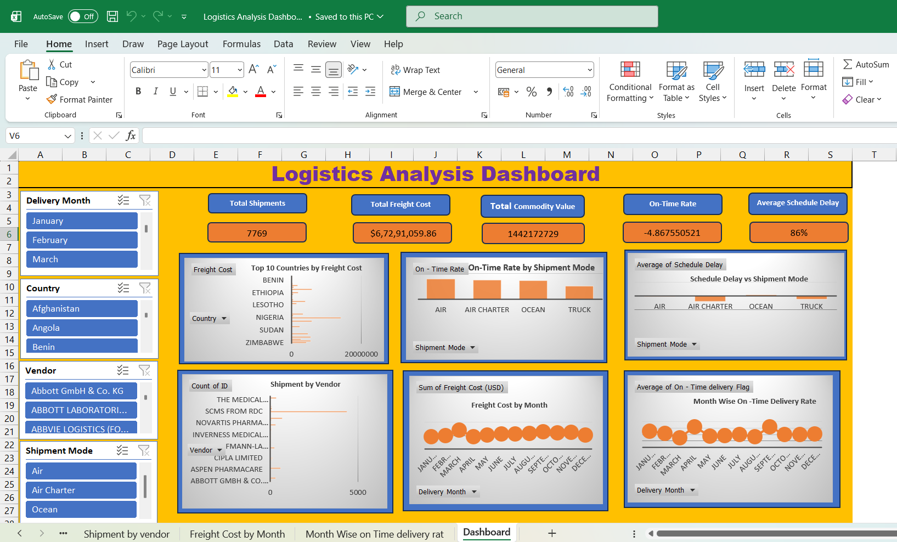

# 📊 Logistics Analysis Dashboard

## 📌 Project Overview
This project showcases a logistics performance dashboard built using Microsoft Excel. It helps analyze delivery performance, cost efficiency, and operational KPIs.

## 🔧 Tools Used
- Microsoft Excel
- Pivot Tables
- Charts & Visualization

  ## 📈 Business Insights
- Identified delays in specific shipment modes
- Analyzed cost distribution across countries
- Observed trends in monthly freight costs
- Highlighted vendors with highest shipment volume

  ## 💡 Skills Demonstrated
- Data Cleaning & Preparation
- Dashboard Design
- KPI Analysis
- Data Visualization

## 🚀 Key Features
- Interactive dashboard
- KPI tracking
- Data-driven insights

## 📁 Project File
👉 👉 [Click here to download the Excel Dashboard](./Logistics Analysis Dashboard.xlsx)
## 📷 Dashboard Preview

